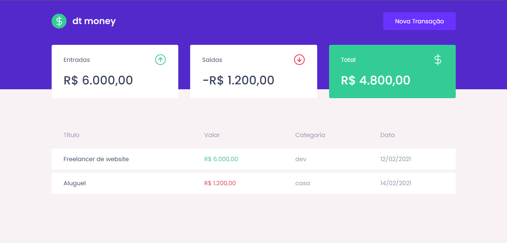
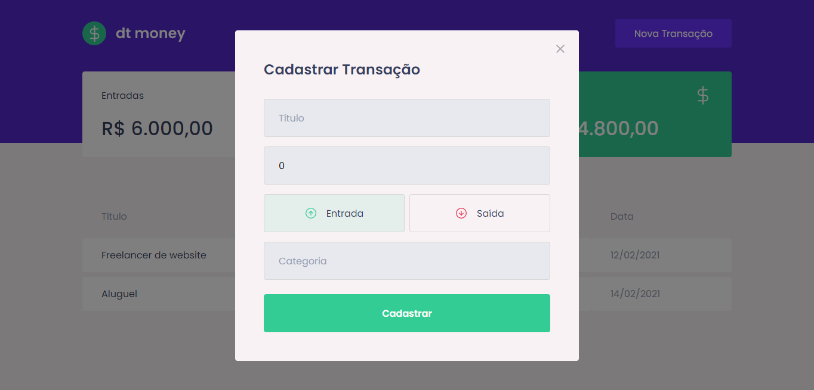

<h3>DT Money</h3> 

Projeto do Chapter II da jornada Ignite da Rocketseat.

Aplicação para controle de entrada e saída de finanças.

Conceitos aprendidos:

- Styled Components
- MirageJS
- Context API
- Hooks
- Axios

Exemplo da aplicação:

